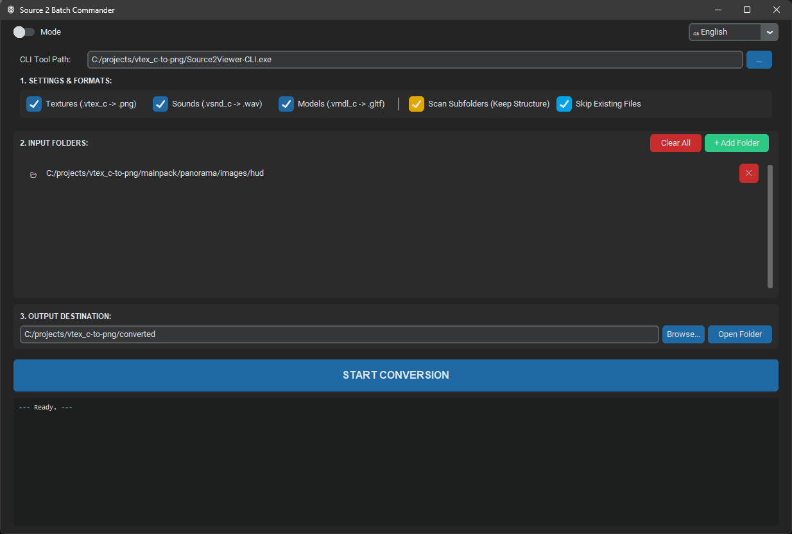
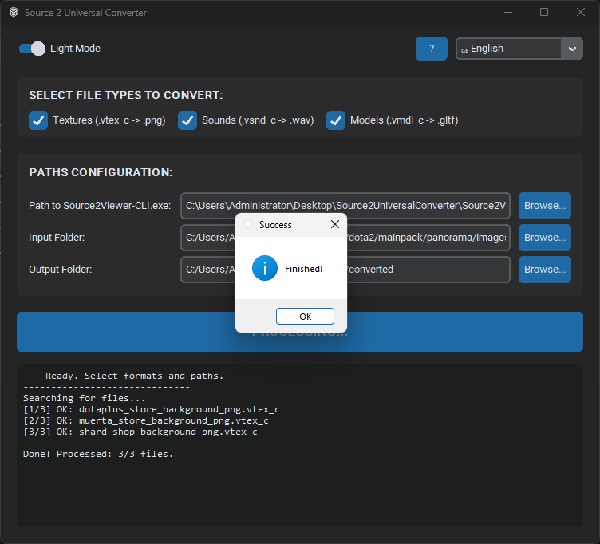

  # Source 2 Converter Pro

  

    
    
    
  

  

    <b>Universal Source 2 resource file format converter.</b> 
    Easily convert compiled game assets into editable formats with a modern GUI.
  

  
   

---

### 🚀 Features

This repository provides a user-friendly GUI tool wrapping the powerful `ValveResourceFormat` library.

* **Textures:** `.vtex_c` → `.png` (Supports transparency)
* **Sounds:** `.vsnd_c` → `.wav`
* **Models:** `.vmdl_c` → `.gltf` (Blender ready)
* **Particles:** `.vpcf_c` → `.txt`

🛠 **[Download the latest version here](../../releases)**

---

### 📸 Eye catchy screenshots

  
  

---

### 🔧 How to Use

1.  Download the `.zip` from **Releases**.
2.  Unzip the folder.
3.  Run `Source2ConverterPro.exe`.
4.  **Important:** Ensure `Source2Viewer-CLI.exe` is in the same folder.
5.  Select your input folder and click **START**.

---

### 🤝 Credits
Powered by [Source 2 Viewer (ValveResourceFormat)](https://github.com/SteamDatabase/ValveResourceFormat).
